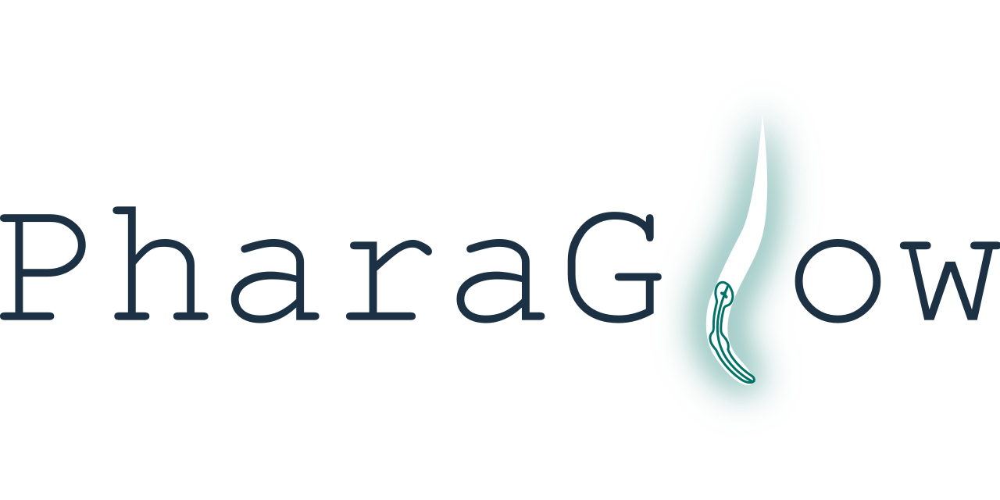

<!--  -->
# PharaGlow - tracking locomotion and feeding behavior of moving worms

<!--  -->

PharaGlow is a python package for tracking and analyzing *C. elegans* motion and feeding behavior from videos.
 The package can be used to simply track labelled pharynxes
 (or whole animals from brightfield) as a simple center of mass tracker,
 but it also has a pipeline to extract pharyngeal pumping and features of the pharynx.

## Installation

1. Install Python >= 3.8

To use `pharaglow` you need first to install `python>=3.8`
We recommend that you install Python using [Anaconda Distribution](https://www.anaconda.com/download).

```bash
# Example: Downloading and Installing Anaconda for Linux (x86)
wget https://repo.anaconda.com/archive/Anaconda3-2023.09-0-Linux-x86_64.sh
bash Anaconda3-2023.09-0-Linux-x86_64.sh
```

2. Create and activate a new `conda` environment

In the terminal (Linux)/Anaconda Command Prompt (Windows) run:

```bash
conda env create --name pumping python=3.8
```

You can now use this environment by running:

```
conda activate pumping
```

3. Install PharaGlow package from PyPI using pip

```
python -m pip install pharaglow
``` 

Alternatively you can clone PharaGlow repository from Github
 
 * Copy the repository link from Github in https://github.com/scholz-lab/PharaGlow/
 
 *  In the terminal (Linux)/Anaconda Command Prompt (Windows),
 navigate to the directory where you wish to download PharaGlow
 and enter the command:

```
git clone https://github.com/scholz-lab/PharaGlow.git pharaglow
```
Change to the pharaglow directory and run:
 
```
cd pharaglow
conda activate pumping
pip install -e .
```
in the main directory of the software, which has the file called `pyproject.toml`

5. (*Optional*)
 *Create a dedicated environment kernel*

```
conda activate pumping
python -m ipykernel install --user --name pumping --display-name "Python (pumping)"
```

*And remove notebook output before committing*

```
conda install -c conda-forge nbstripout
```
## Overview


**1. Step -  Basic object detection**
    This step creates a "_features.json" file
	which contains a table of objects (worms) detected in each frame.
	It creates also a stack of images that contain a cropped area around each worm.
    
**2. Step - Linking objects into trajectories**
    This step results in individual files "_trajectory.json" and _images.tiff for each tracked animal.
    
**3. Step - Analyzing the details of object shapes**
    This step is doing the heavy lifting:
	It extracts centerlines, widths, contours and other object descriptors from the objects.
	It results in individual files "_result.json" for each tracked animal.
	
All subsequent analyses steps add 'columns' to the dataframe,
 and thus features is a subset of trajectories is a subset of results.


## Quick Start
### Run PharaGlow on a demo dataset
* We provide a demo data set with 1000 frames of 1x magnification (30 fps, 2.34 um per pixel) showing *C. elegans* expressing *myo-2::mCherry*.
https://osf.io/fy4ed/. You can also find the expected outputs in the data repository at OSF.

* Before analyzing your data, we recommend to check your installation and familiarize yourself with the code by running the jupyter notebook
 "testing/PharaGlowMain_testdata.ipynb" on this dataset using the provided parameter file "AnalysisParameters_1x.json"


### Run PharaGlow on your data
#### Raw files requirement
Raw data are tiff files
 typically obtained from simultaneously recording of up to 50 adults worms at 30 frames per second at 1x magnification. Typical use is by interacting through the notebook which contains the whole pipeline from raw movies to final data.

#### Parameters file
PharaGlow requires a json parameter file with the parameters that are editable by you. 
A default file comes with the repository, you can use it as a starting point (AnalysisParameters_1x.json).
These parameters are:

| Field | Description |
|-------|-------------|
| **subtract** | (0 or 1) Subtract the background from the movie for detection. Helps particularly with the higher resolution movies.|
| **smooth** | (integer, >= 0, in pixel) Should the image be smoothed. This helps to avoid breaking up the pharynx into two parts.|
| **dilate** | (integer, >=1) Binary dilation of the image. Can help to connect the worm if its broken up into two pieces.|
| **tfactor** | (float,[0-1]) Use rarely. If you have disparate sizes the automated threshold doesn't work well. This factor multiplies the threshold value for binarization. Eg. for an 8-bit image, if the threshold is 150 and tfactor is 0.5 the image would be thresholded at 150*0.5=75.|
| **thresholdWindow** | (in frames) To get a threshold for binarization, use every nth frame of the movie evenly spaced up to N=thresholdWindow.| 
| **bgWindow** |(in frames) Calculate a static background on every nth evenly spaced movie image of the movie with a total N=bgWindow. If this is too short, you get a memory error. It can be as large as 500 frames for a full 18000 frame movie.|
| **length** | (in pixel) This sets the size of the extracted images around the center of the worm. It should be at least as large as the largest expected worm length. |
| **watershed** | (in pixel) When two or more worms touch, how large is an individual approximately.|
| **minSize** | (in pixel) Remove all objects smaller than this.|
| **maxSize** | (in pixel) Remove all objects larger than this (but a caveat here is when we have worm collisions where we allow the resulting segmentation to be a bit bigger). |
| **searchrange** | (in pixel) Describes how much we expect a worm to move frame-to-frame when we link particles together during tracking. This can be a bit bigger to allow for loosing the worm for a bit, but then you might get large perceived jumps in velocity.|
| **memory** | (in frames) When we loose a worm for a few frames, how long can gaps be until we call it a 'new' worm.|
| **minimalDuration** | (in frames) Filters out worm trajectories that are shorter than this.|
| **widthStraight** | (in pixel) How wide is a worm for the straightened image.|
| **pad** | (in pixel) crops a boundary around a worm for image analysis. this helps when the mask is a bit too small.|
| **nPts** | (integer) How many points along the centerline are we measuring. This should relate to the typical length of a worm.|
| **linewidth** | (integer) number of points to sample for a kymograph. 1 means only pixels directly on the centerline are taken.|

#### Run PharaGlow on a single data set
If you want to analyze one data set,
run the notebook PharaGlowMain (PharaGlow > notebooks > PharaGlowMain.ipynb)
as shown in the section above #Run PharaGlow on a demo dataset
* Open the notebook /notebooks/PharaGlowMain.ipynb
* Edit the section called 'Input parameters' to point to your data, to the location where outputs should be stored, and to the analysis parameter file. 
* If you use a similar imaging setup as we describe in our preprint (1x magnification, pixel size ~ 2.35 um), you can use the AnalysisParameter file that comes with this repository.
* Execute the cells. You can see intermediate steps like the masking and the number of objects detected
* output files will be saved at your designated 'outPath' location


#### Run PharaGlow on multiple data sets
If you want to analyze multiple data sets,
you need (in PharaGlow > notebooks) :  
1. pglow_batch_config.json
2. runPGlow_HPC.py
3. PharaGlowHPC.ipynb


### Understanding the output files
The program generates 3 levels of outputs (see [Overview](#overview)). The final full analysis is present in the files called (movie_ID)_results.json
| Column | Type | Description |
|-------|-------|-------------|
| Centerline | object  | centerline of the pharynx, ordered coordinates from anterior to posterior
|  Straightened | object  | straightened image of the oharynx
|  frame | int64   | frame number from original recording	
|  Imax |  uint8   | maximal image intensity
|  Imean | float64 | mean image intensity
|  Imedian | float64 | median image intensity
|  Istd |  float64 | standard deviaton image intensity
|  Area2 | int64   | area estimated from second thresholding in 3. analysis step (px)
|  image_index | int64   | index of images correpsonding to location in images_all.tiff stack.
|  has_image | int64   | boolean indicating missing images
|  y |     float64 | y coordinate of pharynx relative to original full frame recording (px)
|  x |     float64 |  x coordinate of pharynx relative to original full frame recording (px)
|  slice_y0 | int64   | slice location used to crop pharynx from full frame image
|  slice_y1 | int64   | slice location used to crop pharynx from full frame image
|  slice_x0 | int64   | slice location used to crop pharynx from full frame image
|  slice_x1 | int64   | slice location used to crop pharynx from full frame image
|  area |  int64   | area estimated from firsth thresholding in 1. analysis step - object detection (px)
|  yw |    float64 | intensity-wighted center of mass location (px)
|  xw |    float64 | intensity-wighted center of mass location (px)
|  shapeY | int64   | image shape Y for cropped image
|  shapeX | int64   | image shape X fro cropped image
|  im_idx | int64   | index of images correpsonding to location in images_all.tiff stack.
|  particle | int64  | particle id assigned during linking (step 2)
|  pumps | floa64  | pumping metric 

## API
https://scholz-lab.github.io/PharaGlow/build/html/pharaglow.html

## References
Tracking is based on the package trackPy (http://soft-matter.github.io/trackpy/v0.4.2/).

## License
scholz-lab/PharaGlow is licensed under the
GNU General Public License v3.0


