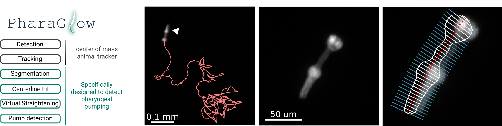
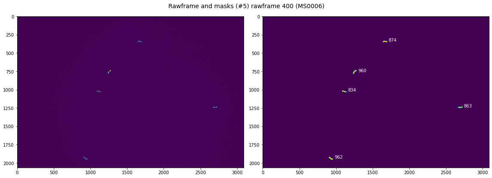
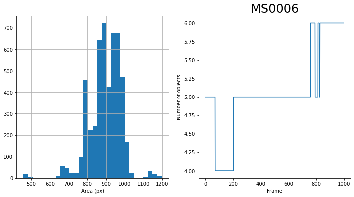
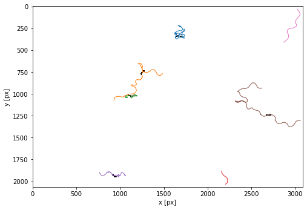
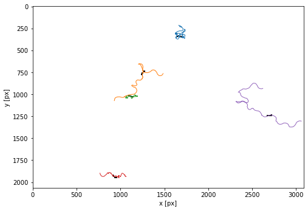
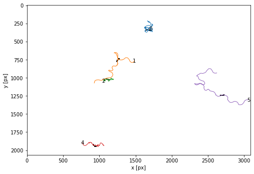

# PharaGlow - tracking locomotion and feeding behavior of moving worms



PharaGlow is a python package for tracking and analyzing *C. elegans* motion and feeding behavior from videos.
 The package can be used to simply track labelled pharynxes
 (or animals from brightfield) as a simple center of mass tracker,
 but it also has a pipeline to extract pharyngeal pumping and features of the pharynx.

## Installation

1. Install Anaconda
You need to have Anaconda (https://www.anaconda.com/products/individual), 
Python >=3.7.
We recommend using Anaconda to install Python and Git.

2. Clone PharaGlow repository from Github in your local directory
 
 * copy the repository link from Github in https://scholz-lab.github.io/PharaGlow/ 
 (in Branch Master > Code > HTTPS OR SSH)
 
 *  In the terminal (Linux)/Anaconda Command Prompt (Windows),
 navigate to the directory where to clone PharaGlow
 and write the git clone command:

```
git clone https://github.com/scholz-lab/PharaGlow.git
```

Note that you can also download PharaGlow from our Github repository (Branch Master > Code > Download ZIP)
to have the current copy of PharaGlow

3. Create and activate the required anaconda environment
In the terminal (Linux)/Anaconda Command Prompt (Windows),
 naviguate to your newly cloned PharaGlow directory
 and run:

```bash
conda env create --file environmentPumping.yml
```

You can now use this environment by running:

```
conda activate pumping
```


4. Install PharaGlow

Last step, (don't forget to activate the pumping environment) run: 
```
python setup.py install --user
```

5. (*optional*)
 *Create a dedicated environment kernel*

```
conda activate myenv
python -m ipykernel install --user --name myenv --display-name "Python (myenv)"
```

*And remove notebook output before committing*

```
conda install -c conda-forge nbstripout
```
## Overview

**1. Step -  Basic object detection**
    This step creates a "_features.json" file
	which contains a table of objects (worms) detected in each frame.
	It creates also a stack of images that contain a cropped area around each worm.
    
**2. Step - Linking objects into trajectories**
    This step results in individual files "_trajectory.json" and _images.tiff for each tracked animal.
    
**3. Step - Analyzing the details of object shapes**
    This step is doing the heavy lifting:
	It extracts centerlines, widths, contours and other object descriptors from the objects.
	It results in individual files "_result.json" for each tracked animal.
	
All subsequent analyses steps add 'columns' to the dataframe,
 and thus features is a subset of trajectories is a subset of results.


## Quick Start
### Run PharaGlow on a demo dataset
* We provide a demo data set with 1000 frames of 1x magnification (30 fps, 2.34 um per pixel) showing *C. elegans* expressing *myo-2::mCherry*.
https://osf.io/fy4ed/. You can also find the expected outputs in the data repository at OSF.

* Before analyzing your data, we recommend to check your installation and familiarize yourself with the code by running the jupyter notebook
 "testing/PharaGlowMain_testdata.ipynb" on this dataset using the provided parameter file "AnalysisParameters_1x.json"

This notebook runs the pharaglow image analysis pipeline. It comprises three stages on analysis which can be done sequentially and are independent. Analyses can be interrupted at the end of each stage after saving the output dataframe. 

**1. Step -  Basic object detection**
    This step creates a "_features.json" file which contains a table of objects detected in each frame.
    Beyond finding the center of mass of an object, no further image analysis is done here.
    
**2. Step - Linking objects into trajectories**
    This results in individual files "_trajectory.json" for each tracked animal.
    
**3. Step - Analysing the details of object shapes**
    This step is doing the heavy lifting: It extracts centerlines, widths, contours and other object descriptors from the objects

All subsequent analyses steps add 'columns' to the data, and thus features is a subset of trajectories is a subset of results.

#### 1. Setup


```python
def setup(parameterfile, inPath, outPath, movie):
    """helper function to simplify the setting up before analysis. Handles path checking and creating, parameter reads ad data reads."""
    ... # see the notebooks directory for more information
    return logger, param, rawframes, lawn, outfile, imfile
```

##### Input parameters


```python
parameterfile = r"C:\Users\bonnard\Documents\GitHub\PharaGlow\AnalysisParameters_1x.json"
inPath = r"C:\Users\bonnard\Documents\DATA\1_rawdata\extern\MS0006"
outPath = r"C:\Users\bonnard\Documents\DATA\3_1_pharaglow\MS0006"
movie = "MS0006"

nWorkers = 4

depth = 'uint8'
save_minimal = True

lawnPath = None #"/opt/data/Lawns/"

logger, param, rawframes, lawn, outfile, imfile = setup(parameterfile, inPath, outPath, movie)
```


#### 2. Object detection

##### Create binary masks


```python
start = timeit.default_timer()

# detecting objects
logger.info('Binarizing images...')

masks = tracking.calculateMask(rawframes,
                               minSize = param['minSize'],
                               bgWindow = param['bgWindow'],
                               thresholdWindow = param['thresholdWindow'],
                               smooth =  param['smooth'],
                               subtract =  param['subtract'],
                               dilate = param['dilate'],
                               tfactor=param['tfactor'])


stop = timeit.default_timer()
logger.info(f"binary masks created ({stop - start}s)")  
```

    INFO:PharaGlow:Binarizing images...
    INFO:PharaGlow:binary masks created (2.287s)


##### Make sure the thresholding worked otherwise change parameters


```python
# Select a rawframe to visualize
t = 400 

if t> (len(rawframes)-1):
    # Check if the selected rawframe is present otherwise t=0
    print(f"Warning ! Max {len(rawframes)} rawframes. {t} changed to 0")
    t=0

print(f"rawframe {t} to visualize ")
```

    rawframe 400 to visualize 


###### Visualize the raw data


```python
plt.figure(figsize=(16,8))

plt.subplot(121)
# Plot the histogram of the pixel intensity values of the rawframe
plt.hist(rawframes[t].ravel(), bins=256, log=True)
plt.xlim(0, 260) # xlim for 8 bits image

plt.subplot(122)
# Adjust the color limit for the rawframe for vizualisation only
color = (0,170) #  0<=color<=255 for 8 bits image
# color = None 
plt.imshow(rawframes[t],clim = color)
plt.colorbar(orientation='horizontal');

plt.savefig(os.path.join(outPath,f'{date.today()}_{movie}_frame{t}_px_hist.pdf'))
```


###### Show the mask and detected objects


```python
# %matplotlib qt

from skimage.measure import label, regionprops

plt.figure(figsize=(16,6))
plt.subplot(121)
# Show the rawframe
plt.imshow(rawframes[t],clim= color)#+lawn)
if lawn is not None:
    # Show the lawn
    plt.contour(binLawn, alpha=0.5, cmap='pink')
    
plt.subplot(122)
# Show the masks and their size [px]
plt.imshow(masks[t])#[:600,1000:])#[500:1500,2000:3500])#[:,2500:])
# print(np.min(masks[t]))
label_image, num = label(masks[t], background=0, connectivity = 1,return_num=True)
print(f"{num} detected objects")
for region in regionprops(label_image):
    plt.text(region.centroid[1]+50, region.centroid[0], region.area, color ='w')
    
plt.tight_layout()

# save the pdf
plt.suptitle(f"Rawframe and masks (#{num}) rawframe {t} ({movie})", fontsize=14)
plt.savefig(os.path.join(outPath,f'{date.today()}_{movie}_frame{t}_masks.pdf'))
```

    5 detected objects





##### Detecting individual objects and tracking or use multiprocessing to speed up feature detection

This section will go through all frames and find worm-sized (as specified by the parameters) objects. It creates a pd.Dataframe containing these and a stack of images (numpy array) that contain a cropped area around each worm. Note: Each worm image will be length x length x 8bit. So with 30 worms per image you expect the image array to be 6Gb/10 minutes.


```python
start = timeit.default_timer()

logger.info('Detecting features...')
logger.info(f'...with {nWorkers} workers')
objects, images = util.parallel_analysis((masks, rawframes), param, tracking.parallelWorker, framenumbers = None, nWorkers = nWorkers, output= None, depth = depth)
# create a link between image and dataframe
objects['im_idx'] = np.arange(len(objects))
stop = timeit.default_timer()
logger.info(f"features detected ({stop - start}s)") 
```

    INFO:PharaGlow:Detecting features...
    INFO:PharaGlow:...with 4 workers


    Analyzing image 0 of 999
    Analyzing image 100 of 999
    Analyzing image 200 of 999
    Analyzing image 300 of 999
    Analyzing image 400 of 999
    Analyzing image 500 of 999
    Analyzing image 600 of 999
    Analyzing image 700 of 999
    Analyzing image 800 of 999
    Analyzing image 900 of 999


    INFO:PharaGlow:features detected (319.0189164s)


```python
# Files monitoring
logger.info(f" Number of frames in features:{objects['frame'].nunique()}")
                                                       
if len(rawframes) != len(objects['frame'].unique()):
    logger.warning(f" Number of frames in features ({objects['frame'].nunique()}) and the number of rawframes ({len(rawframes)}) don't match !")
```

    INFO:PharaGlow: Number of frames in features:999


##### Visualize results of object detection


```python
### Show the area of all objects
plt.figure(figsize=(12,6))
plt.subplot(121)
objects['area'].hist(bins = 30)
plt.xlabel('Area (px)')
plt.subplot(122)
objects['frame'].value_counts().sort_index().plot()
plt.ylabel('Number of objects')
plt.xlabel('Frame')

# save the pdf
plt.title(f"{movie}", fontsize=24)
plt.savefig(os.path.join(outPath,f'{date.today()}_{movie}_objects_.pdf'))

logger.info(f"features.area.min():{objects.area.min()}") # region.area > params['minSize']
logger.info(f"features.area.max():{objects.area.max()}") # region.area < params['maxSize']
```
    INFO:PharaGlow:features.area.min():458
    INFO:PharaGlow:features.area.max():1197




##### Save features and images

```python
start = timeit.default_timer()
# saving features
logger.info("Saving features...")
objects.info(memory_usage='deep')
objects.to_json(outfile.format('features', 'all'), orient='split')
stop = timeit.default_timer()
logger.info(f"features saved as {outfile.format('features', 'all')} ({stop - start}s)")

start = timeit.default_timer()
# saving images
imsave(imfile.format('images', 'all'), images)
stop = timeit.default_timer()
logger.info(f"images saved as {imfile.format('images', 'all')} ({stop - start}s)")
```

This step results in a features file which contains center-of-mass tracking information, and an images files which are cropped regions of interest around a worm.

###### (Optional) Load features and images if continuing prior analysis


```python
%%time
# leaving this here for re-analysis
if False:
    # Load feature
    start = timeit.default_timer()
    logger.info("Loading features...")
    objects = io.load(outfile.format('features', 'all'), orient='split')
    images = pims.open(imfile.format('images', 'all'))
    stop = timeit.default_timer()
    logger.info(f"features loaded ({stop - start}s)")
```

    Wall time: 0 ns


#### 3. Creating trajectories

##### Link objects to trajectories using trackpy and interpolate short misses


```python
logger.info('Linking trajectories...')
logger.info(f"Parameter searchRange: {param['searchRange']} px")
logger.info(f"Parameter memory: {param['memory']} frames")
```

    INFO:PharaGlow:Linking trajectories...
    INFO:PharaGlow:Parameter searchRange: 10 px
    INFO:PharaGlow:Parameter memory: 30 frames


```python
trajectories = tp.link_df(objects,param['searchRange'], memory = param['memory'])
logger.info(f"Number of trajectories after linking: {len(trajectories['particle'].unique())}")
```

    INFO:PharaGlow:Number of trajectories after linking: 8


##### Show the trajectories

```python
plt.figure(figsize=(8,8))
tp.plot_traj(trajectories, colorby = 'particle', superimpose=1-masks[t],label=False);
```



```python
logger.info(f"Filtering out trajectories which last less than the minimal duration ({param['minimalDuration']} frames)...")
logger.info(f"Nb of trajectories before filtering: {trajectories['particle'].nunique()}")

trajectories = tp.filter_stubs(trajectories,param['minimalDuration'])
logger.info(f"Nb of trajectories after filtering: {trajectories['particle'].nunique()}")
```

    INFO:PharaGlow:Filtering out trajectories which last less than the minimal duration (600 frames)...
    INFO:PharaGlow:Nb of trajectories before filtering: 8
    INFO:PharaGlow:Nb of trajectories after filtering: 5


```python
fig = plt.figure(figsize=(8,8))
ax = tp.plot_traj(trajectories, colorby = 'particle', superimpose=1-masks[t],label=False);
# save the pdf
ax.set_title(f"{movie}", fontsize=24)
fig.savefig(os.path.join(outPath,f'{date.today()}_{movie}_trajectories_filtered.pdf'))

# with labels
fig = plt.figure(figsize=(8,8))
ax = tp.plot_traj(trajectories, colorby = 'particle', superimpose=1-masks[t],label=True);
# save the pdf
ax.set_title(f"{movie}", fontsize=24)
fig.savefig(os.path.join(outPath,f'{date.today()}_{movie}_trajectories_filtered_labelled.pdf'))
```







##### Save individual trajectories & add the missing images to interpolated trajectories

Here we do multiple things: Add missing rows to the trajectory, create a separate image stack for each animal and save the trajectories.


```python
logger.info(f"Saving {trajectories['particle'].nunique()} trajectories to separate files...")

start = timeit.default_timer()

for particle_index in trajectories['particle'].unique():
    tmp = trajectories[trajectories.loc[:,'particle'] == particle_index].copy()
    ims = images[tmp['im_idx']]
    ims = np.array(ims, dtype = 'uint8')
    # generate an interpolated trajectory where all frames are accounted for
    traj_interp, ims_interp = tracking.interpolate_helper(rawframes, ims, tmp, param)
    # save the new single worm movie
    imsave(imfile.format('images', particle_index), np.array(ims_interp, dtype='uint8'))
    # save the trajectory
    traj_interp.to_json(outfile.format('trajectories', int(particle_index)), orient='split')
    
stop = timeit.default_timer()
logger.info(f"trajectories saved as json files ({stop - start}s)") 
```

    INFO:PharaGlow:Saving 5 trajectories to separate files...
    INFO:PharaGlow:trajectories saved as json files (0.692s)


#### 3. Run the whole pharaglow feature extraction


```python
start = timeit.default_timer()
# save only minimal outputs - reduces save by approx factor 3

# analyze all trajectories
for fn in os.listdir(outPath):
    file = os.path.join(outPath,fn)
    
    if os.path.isfile(file) and f'{movie}_trajectories_' in fn and fn.endswith('.json'):
        particle_index = int(fn.split('.')[0].split('_')[-1])
        traj =  io.load(file, orient='split')
        # load images
        images = pims.open(imfile.format('images', particle_index))
        if len(traj.index)<1:
            print('Skipped', file)
            continue
        logger.info('Analyzing trajectory:%s', fn)
        
        tmp,_ = util.parallel_analysis((images,), param,\
                          parallelWorker= run.parallel_pharaglow_run, framenumbers = traj['frame'], nWorkers = nWorkers, output= None)
        # add basic image properties
        tmp['Imax'] = np.max(images, axis=(1,2))
        tmp['Imean'] = np.mean(images, axis=(1,2))
        tmp['Imedian']= np.median(images, axis=(1,2))
        tmp['Istd']= np.std(images, axis=(1,2))
        tmp['Area2'] = [np.sum(mask) for mask in tmp['Mask']]
        # remove some columns to make the result smaller
        if save_minimal:
            tmp = tmp.drop(['Mask', 'SkeletonX', 'SkeletonY', 'ParX', 'ParY', 
                            'Xstart', 'Xend', 'dCl', 'Widths', 'Contour', 'Gradient', 
                            'Kymo', 'KymoGrad', 'Similarity', 'Xtmp'], axis = 1, errors = 'ignore')
        # add the basic tracker info - you can also keep these as separate files
        tmp = tmp.merge(traj, on='frame', how = 'outer')
        # drop nans to allow post processing
        tmp = tmp.dropna()
        print(tmp.info())
        # run some stuff on the whole dataframe.
        run.pharynxorientation(tmp)
        # extract pumps
        tmp[['pumps']] = tmp.apply(\
        lambda row: pd.Series(features.extractPump(row['Straightened'])), axis=1)
        # get more exact entry location
        if lawn is not None:
            tmp['insideHead'] = tmp.apply(\
                lambda row: pd.Series(features.headLocationLawn(row['Centerline'],row['slice'], binLawn)), axis=1)
            tmp['insideHeadIntensity'] = tmp.apply(\
                lambda row: pd.Series(features.headLocationLawn(row['Centerline'],row['slice'], lawn)), axis=1)
        
        tmp.to_json(outfile.format('results', particle_index), orient='split')
        
if save_minimal:
    logger.info('minimal information saved')
    
stop = timeit.default_timer()
logger.info(f"Whole pharaglow features extracted ({stop - start}s)")  
```

    INFO:PharaGlow:minimal information saved
    INFO:PharaGlow:Whole pharaglow features extracted (963.5043299000099s)


### Run PharaGlow on your data
#### Raw files requirement
Raw data are tiff files
 typically obtained from simultaneously recording of up to 50 adults worms at 30 frames per second at 1x magnification. Typical use is by interacting through the notebook which contains the whole pipeline from raw movies to final data.
 It comprises three stages on analysis which can be done sequentially and are independent. Analyses can be interrupted at the end of each stage after saving the output dataframe.
 
#### Parameters file
PharaGlow requires a json parameter file with the parameters that are editable by you. 
A default file comes with the repository, you can use it as a starting point (AnalysisParameters_1x.json)
These parameters are:


| **Parameters**  | **Value**  |                                                                                                                      |
| subtract        | 0          | subtract the background from the movie for detection. Helps particularly with the higher resolution movies (0 or 1)  |
| smooth          | 3          | should the image be smoothed. This helps to avoid breaking up the pharynx into two parts (integer >=0 in px)         |


#### Run PharaGlow on a single data set
system requirement

#### Run PharaGlow in parallel processing
system requirement


## API
https://scholz-lab.github.io/PharaGlow/build/html/pharaglow.html
## Code contributors
## References
Tracking is based on the package trackPy (http://soft-matter.github.io/trackpy/v0.4.2/).
## License


