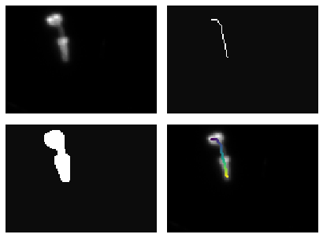
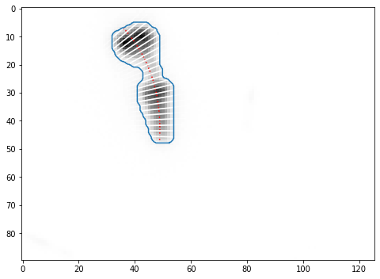
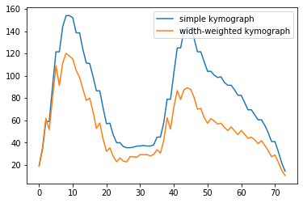
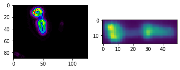

# PharaGlow

Package to track and analyze C. elegans pharynx from movies. 

### Installation
5. Install pharaglow
python setup.py install --user

### Example running pharaGlow

```python
import matplotlib.pylab as plt
import numpy as np
from skimage.io import imread

import pharaglow.features as pg
```


```python
# load data
fname = '/media/scholz_la/hd2/Data/PumpTest/mCherry3-1_pumping.tif'
data = imread(fname, as_gray=False, plugin=None)
data = data[:, 60:150, 90:]
```


```python
# preprocessing image
im = data[150]
mask = pg.thresholdPharynx(im)
skel = pg.skeletonPharynx(mask)
order = pg.sortSkeleton(skel)
ptsX, ptsY = np.where(skel)
ptsX, ptsY = ptsX[order], ptsY[order]
```


```python
plt.figure(figsize=(8, 4))
plt.subplot(221)
plt.imshow(im, cmap=plt.cm.gray, interpolation='nearest')
plt.axis('off')
plt.subplot(222)
plt.imshow(skel,  cmap='gray', interpolation='nearest', alpha=0.95)
plt.axis('off')
plt.subplot(223)
plt.imshow(mask, cmap='gray', interpolation='nearest', alpha=0.95)
plt.axis('off')
plt.subplot(224)
plt.imshow(im, cmap='gray')
plt.scatter(ptsY, ptsX, c=order, s = 5);
plt.axis('off')
plt.subplots_adjust(hspace=0.1, wspace=-0.45, top=1, bottom=0, left=0, right=1)
plt.show()
```





```python
# getting centerline and width
poptX, poptY = pg.fitSkeleton(ptsX, ptsY)
contour = pg.morphologicalPharynxContour(mask, scale = 4, smoothing=2)
xstart, xend = pg.cropcenterline(poptX, poptY, contour, nP = len(ptsX))
xs = np.linspace(xstart, xend, 25)
cl = pg.centerline(poptX, poptY, xs)
dCl = pg.normalVecCl(poptX, poptY, xs)
widths = pg.widthPharynx(cl, contour, dCl)
lw = 10
wL =  np.stack([cl+lw*dCl, cl-lw*dCl], axis=1)
```


```python
plt.figure(figsize=(8, 8))
plt.imshow(255-im, cmap = 'gray')
plt.plot(cl[:,1], cl[:,0], 'r:')
plt.plot(contour[:,1], contour[:,0], zorder=10)
[plt.plot(wL[i,:,1], wL[i,:,0], 'w', alpha =0.5) for i in range(len(xs)-1)];

[plt.plot(widths[i, :,1], widths[i, :,0], 'w') for i in range(len(cl))];
```





```python
kymo = pg.intensityAlongCenterline(im, cl, linewidth =2)
kymoWeighted = pg.intensityAlongCenterline(im, cl, width = pg.scalarWidth(widths))

```


```python
# show different linescans - this helps to identify front and back of pharynx
plt.plot(kymo, label='simple kymograph')
plt.plot(kymoWeighted, label='width-weighted kymograph')
plt.legend();
```





```python
#local derivative, can enhance contrast
grad = pg.gradientPharynx(im)
# straightened image
straightIm = pg.straightenPharynx(im, xstart, xend, poptX, poptY, width=np.max(pg.scalarWidth(widths))//2)
```


```python
plt.subplot(121)
plt.imshow(grad, cmap = plt.cm.nipy_spectral)
plt.subplot(122)
plt.imshow(straightIm.T)
```


    <matplotlib.image.AxesImage at 0x7f19f1d232e8>





```python
# local gradient enhances anatomical features
kymo = pg.intensityAlongCenterline(grad, cl, linewidth =5)
kymoWeighted = pg.intensityAlongCenterline(grad, cl, width = pg.scalarWidth(widths))

```


```python
# show different linescans - this helps to identify front and back of pharynx
# notice rge drop for the grinder!
plt.plot(kymo, label='simple kymograph')
plt.plot(kymoWeighted, label='width-weighted kymograph')
plt.legend();
```


```python

```
